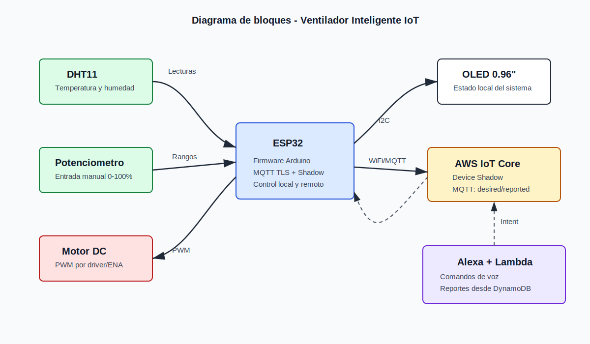
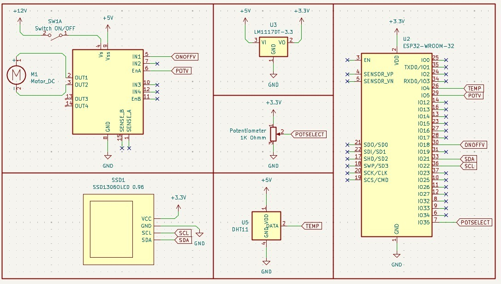
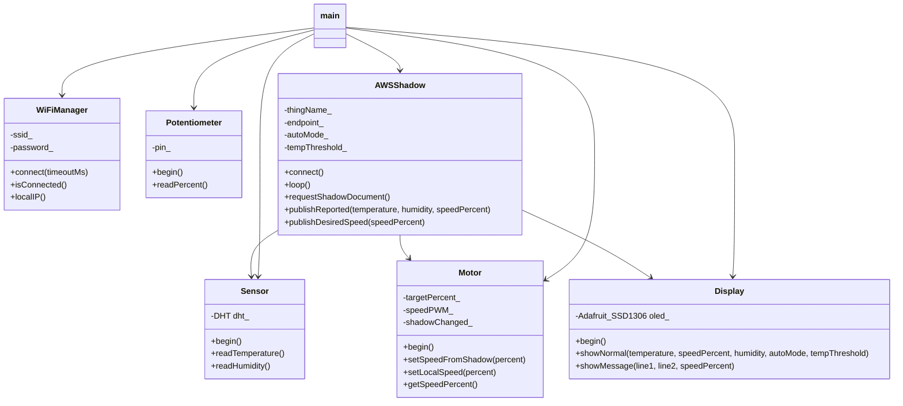
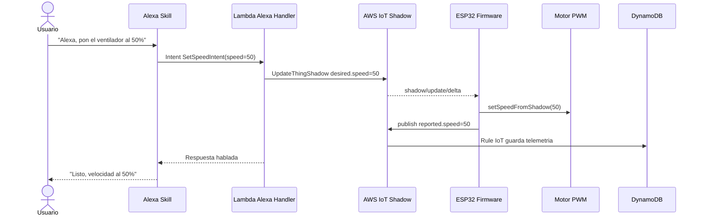
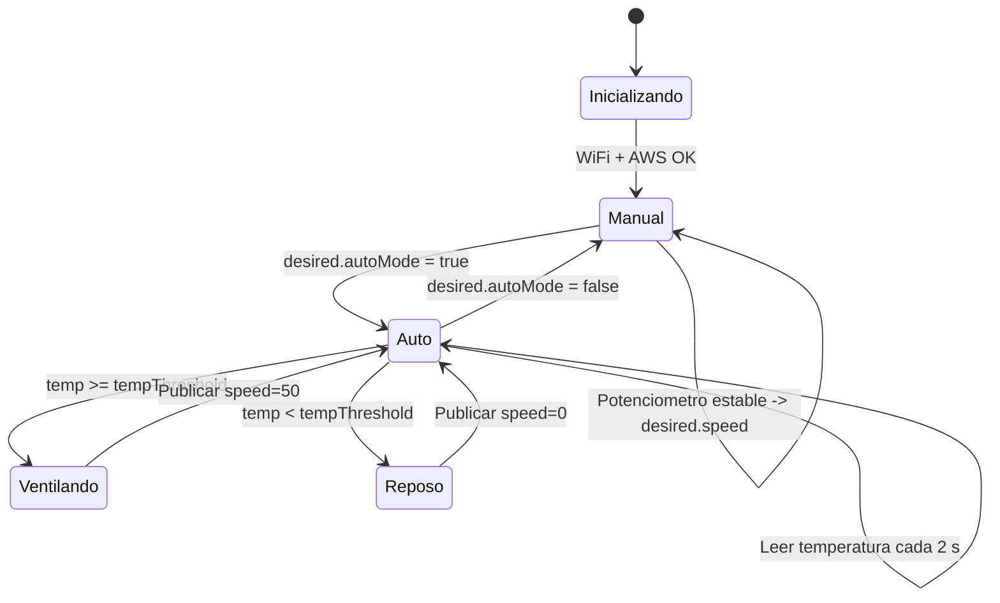
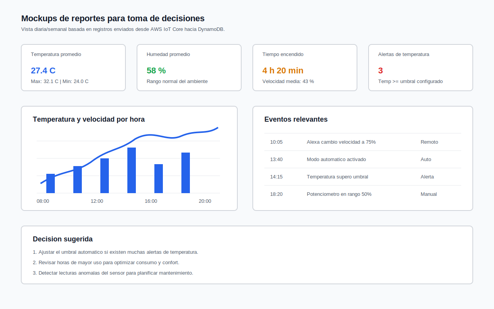
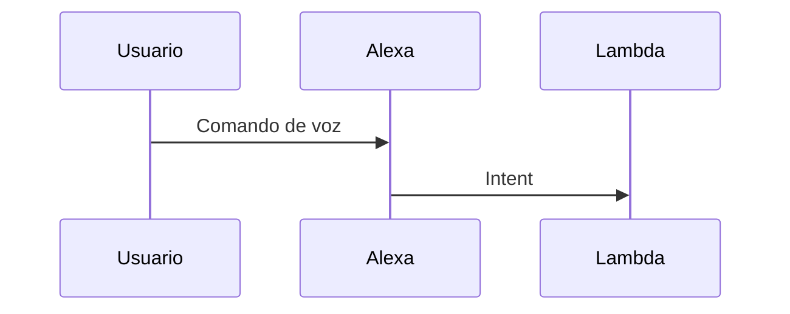

# 4.2 Informe Tecnico (Formato Digital)

## Ventilador Inteligente IoT con ESP32, AWS IoT Core y Alexa

**Proyecto:** Practica 4 IoT  
**Repositorio:** `Practica4IoT`  
**Fecha:** 24 de mayo de 2026

## Integrantes

- Gabriel Herrera
- Nicole Gomez
- Fernando Rodriguez

## Alcance del documento

Este informe fue elaborado a partir de los archivos del repositorio:

- `platformio.ini`: configuracion del proyecto ESP32 con framework Arduino.
- `src/main.cpp`: flujo principal del firmware.
- `src/AWSShadow.*`: conexion MQTT segura y sincronizacion con AWS IoT Shadow.
- `src/Sensor.*`: lectura de temperatura y humedad con DHT11.
- `src/Motor.*`: control PWM del ventilador.
- `src/Potentiometer.*`: lectura analogica para control manual.
- `src/Display.*`: interfaz local en pantalla OLED SSD1306.
- `src/WiFiManager.*`: conexion WiFi.

No se encontraron archivos de backend Lambda, configuracion exportada de Alexa ni capturas de AWS en el repositorio. Por eso, las secciones de Alexa, Lambda, DynamoDB y reportes se documentan como diseno tecnico y configuracion esperada, manteniendolas consistentes con el firmware implementado.

> **Nota de seguridad:** el informe no incluye certificados, claves privadas ni contrasenas. Para entrega final se recomienda rotar cualquier credencial que haya sido usada en pruebas y mover secretos a archivos no versionados.

## Indice

1. [Requerimientos funcionales y no funcionales](#1-requerimientos-funcionales-y-no-funcionales)
2. [Diseno del sistema](#2-diseno-del-sistema)
3. [Diseno de la skill de Alexa](#3-diseno-de-la-skill-de-alexa)
4. [Diseno de reportes](#4-diseno-de-reportes)
5. [Diseno del modelo de datos para DynamoDB](#5-diseno-del-modelo-de-datos-para-dynamodb)
6. [Implementacion](#6-implementacion)
7. [Configuraciones en Alexa y AWS](#7-configuraciones-en-alexa-y-aws)
8. [Pruebas y validaciones](#8-pruebas-y-validaciones)
9. [Resultados](#9-resultados)
10. [Conclusiones](#10-conclusiones)
11. [Recomendaciones](#11-recomendaciones)
12. [Anexos](#12-anexos)

---

# 1. Requerimientos Funcionales y No Funcionales

## 1.1 Requerimientos funcionales

| ID | Requerimiento | Descripcion | Evidencia en el proyecto |
| --- | --- | --- | --- |
| RF-01 | Conexion WiFi | El dispositivo debe conectarse a una red WiFi antes de iniciar el servicio IoT. | `WiFiManager.cpp`, `main.cpp` |
| RF-02 | Conexion a AWS IoT Core | El ESP32 debe conectarse por MQTT seguro a AWS IoT Core usando certificados TLS. | `AWSShadow.cpp` |
| RF-03 | Lectura ambiental | El sistema debe medir temperatura y humedad. | `Sensor.cpp`, DHT11 en GPIO 4 |
| RF-04 | Control manual | El usuario debe poder ajustar la velocidad con potenciometro. | `Potentiometer.cpp`, GPIO 35 |
| RF-05 | Control remoto | El sistema debe aceptar cambios remotos desde AWS IoT Shadow. | Topic `shadow/update/delta` |
| RF-06 | Control por Alexa | La skill debe permitir encender, apagar, cambiar velocidad, activar modo automatico y consultar estado. | Diseno de Skill + Lambda |
| RF-07 | Modo automatico | Si `autoMode` esta activo, el ventilador debe responder al umbral `tempThreshold`. | `main.cpp`, `AWSShadow.cpp` |
| RF-08 | Visualizacion local | La pantalla OLED debe mostrar temperatura, humedad, velocidad, modo y umbral. | `Display.cpp` |
| RF-09 | Publicacion de estado | El ESP32 debe publicar estado reportado cuando haya cambios relevantes o cada 10 minutos. | `publishReported()` |
| RF-10 | Persistencia historica | AWS debe almacenar telemetria y eventos en DynamoDB mediante una regla IoT. | Diseno AWS/DynamoDB |
| RF-11 | Reportes | El sistema debe permitir revisar KPIs utiles para decisiones de uso y mantenimiento. | Diseno de reportes |

## 1.2 Requerimientos no funcionales

| ID | Requerimiento | Descripcion |
| --- | --- | --- |
| RNF-02 | Disponibilidad | El firmware debe intentar reconectarse a AWS si se pierde la conexion MQTT. |
| RNF-04 | Escritura local | El sistema debe escribir localmente el estado principal del ventilador y las lecturas del sensor en la pantalla OLED. |
| RNF-05 | Usabilidad | El usuario puede operar el ventilador por voz, potenciometro y escritura local del estado. |
| RNF-06 | Mantenibilidad | El firmware esta separado en clases: WiFi, sensor, motor, display, potenciometro y AWS Shadow. |
| RNF-07 | Escalabilidad | DynamoDB permite almacenar telemetria por dispositivo y tiempo. |
| RNF-08 | Confiabilidad | El potenciometro usa lectura promediada y debounce para evitar cambios falsos. |
| RNF-09 | Trazabilidad | Los eventos deben quedar asociados a fecha, dispositivo, modo y velocidad. |

---

# 2. Diseno del Sistema

## 2.1 Descripcion general

El sistema es un ventilador inteligente basado en ESP32. El dispositivo mide temperatura y humedad, controla la velocidad de un motor DC mediante PWM, permite control manual con potenciometro y sincroniza su estado con AWS IoT Core mediante Device Shadow.

La integracion con Alexa se plantea mediante una Skill personalizada. Alexa envia intents a una funcion Lambda; Lambda actualiza el estado `desired` del Shadow; el ESP32 recibe el cambio por MQTT, aplica la accion y publica el estado `reported`. Una regla de IoT Core guarda los datos en DynamoDB para construir reportes.

## 2.2 Componentes principales

| Componente | Funcion | Archivo / configuracion |
| --- | --- | --- |
| ESP32 DevKit | Microcontrolador principal, WiFi y ejecucion del firmware. | `platformio.ini` |
| DHT11 | Sensor de temperatura y humedad. | `Sensor.cpp` |
| OLED SSD1306 | Pantalla local de estado. | `Display.cpp` |
| Potenciometro | Entrada analogica para velocidad manual. | `Potentiometer.cpp` |
| Motor DC + driver | Actuador del ventilador controlado por PWM. | `Motor.cpp` |
| AWS IoT Core | Broker MQTT, certificados y Device Shadow. | `AWSShadow.cpp` |
| Alexa Skill | Interfaz de voz del usuario. | Diseno de Skill |
| Lambda | Backend para interpretar intents y consultar/actualizar AWS. | Diseno backend |
| DynamoDB | Almacenamiento de telemetria, comandos y reportes. | Diseno modelo de datos |

## 2.3 Pines del ESP32

| Funcion | Pin ESP32 | Detalle |
| --- | --- | --- |
| DHT11 DATA | GPIO 4 | Lectura de temperatura y humedad |
| Potenciometro | GPIO 35 | Entrada ADC, lectura 0-4095 mapeada a 0-100% |
| OLED SDA | GPIO 21 | Bus I2C |
| OLED SCL | GPIO 22 | Bus I2C |
| Motor IN1 | GPIO 18 | Direccion/activacion del driver |
| Motor ENA/PWM | GPIO 5 | PWM canal 0, 5000 Hz, resolucion 8 bits |
| Alimentacion logica | 3V3/VIN | Segun modulo utilizado |
| Tierra | GND | Tierra comun para ESP32, sensores y driver |

## 2.4 Diagrama de bloques




## 2.5 Diagrama electronico

<p align="center">


## 2.8 Diagramas estructurales y de comportamiento

### 2.8.1 Diagrama estructural de clases



### 2.8.2 Diagrama de comportamiento: control remoto por Alexa



### 2.8.3 Diagrama de comportamiento: modo automatico



---

# 3. Diseno de la Skill de Alexa

## 3.1 Objetivo de la skill

Permitir que el usuario controle el ventilador mediante comandos de voz y consulte su estado ambiental sin interactuar fisicamente con el dispositivo.

## 3.2 Nombre e invocacion

| Elemento | Propuesta |
| --- | --- |
| Nombre de la skill | Ventilador Inteligente |
| Nombre de invocacion | ventilador inteligente |
| Idioma | Espanol |
| Endpoint | AWS Lambda |
| Tipo de skill | Custom Skill |

## 3.3 Intents propuestos

| Intent | Slots | Ejemplos de frases | Accion esperada |
| --- | --- | --- | --- |
| `TurnOnIntent` | - | "enciende el ventilador" | Actualiza `desired.speed` a 50 |
| `TurnOffIntent` | - | "apaga el ventilador" | Actualiza `desired.speed` a 0 |
| `SetSpeedIntent` | `speed` | "pon el ventilador al 75 por ciento" | Actualiza `desired.speed` |
| `SetAutoModeIntent` | `mode` | "activa el modo automatico" | Actualiza `desired.autoMode` |
| `SetThresholdIntent` | `temperature` | "configura el umbral a 30 grados" | Actualiza `desired.tempThreshold` |
| `GetStatusIntent` | - | "cual es el estado del ventilador" | Lee Shadow/DynamoDB y responde estado actual |
| `GetReportIntent` | `period` | "dame el reporte de hoy" | Consulta DynamoDB y responde KPIs |

## 3.4 Interaction Model propuesto

```json
{
  "interactionModel": {
    "languageModel": {
      "invocationName": "ventilador inteligente",
      "intents": [
        {
          "name": "SetSpeedIntent",
          "slots": [
            {
              "name": "speed",
              "type": "AMAZON.NUMBER"
            }
          ],
          "samples": [
            "pon el ventilador al {speed} por ciento",
            "cambia la velocidad a {speed}",
            "ajusta el ventilador al {speed} por ciento"
          ]
        },
        {
          "name": "SetAutoModeIntent",
          "slots": [
            {
              "name": "mode",
              "type": "AUTO_MODE"
            }
          ],
          "samples": [
            "{mode} el modo automatico",
            "pon el ventilador en modo {mode}"
          ]
        },
        {
          "name": "SetThresholdIntent",
          "slots": [
            {
              "name": "temperature",
              "type": "AMAZON.NUMBER"
            }
          ],
          "samples": [
            "configura el umbral a {temperature} grados",
            "usa {temperature} grados como limite"
          ]
        },
        {
          "name": "GetStatusIntent",
          "slots": [],
          "samples": [
            "cual es el estado",
            "como esta el ventilador",
            "que temperatura hay"
          ]
        }
      ],
      "types": [
        {
          "name": "AUTO_MODE",
          "values": [
            { "name": { "value": "activar" } },
            { "name": { "value": "desactivar" } },
            { "name": { "value": "automatico" } },
            { "name": { "value": "manual" } }
          ]
        }
      ]
    }
  }
}
```

## 3.5 Estados del Shadow usados por Alexa

```json
{
  "state": {
    "desired": {
      "speed": 50,
      "autoMode": true,
      "tempThreshold": 30
    },
    "reported": {
      "temperature": 27.4,
      "humidity": 58.0,
      "speed": 50,
      "autoMode": true,
      "tempThreshold": 30
    }
  }
}
```

---

# 4. Diseno de Reportes

## 4.1 Objetivo de los reportes

Los reportes deben convertir la telemetria del ventilador en informacion util para tomar decisiones, por ejemplo:

- Identificar horas con mayor temperatura.
- Evaluar si el umbral automatico es adecuado.
- Detectar uso excesivo o innecesario del ventilador.
- Revisar estabilidad de humedad y temperatura.
- Reconocer eventos anormales del sensor o del motor.

## 4.2 Mockups de reportes



## 4.3 Indicadores relevantes

| Indicador | Fuente | Utilidad |
| --- | --- | --- |
| Temperatura promedio | `temperature` | Evaluar confort termico |
| Temperatura maxima | `temperature` | Detectar sobrecalentamiento |
| Humedad promedio | `humidity` | Analizar condiciones ambientales |
| Velocidad promedio | `speed` | Estimar intensidad de uso |
| Tiempo encendido | `speed > 0` | Medir uso total del ventilador |
| Tiempo en modo automatico | `autoMode = true` | Evaluar dependencia del control automatico |
| Alertas por umbral | `temperature >= tempThreshold` | Ajustar reglas de control |
| Cambios remotos/manuales | `source` o eventos | Auditar comportamiento del usuario |

---

# 5. Diseno del Modelo de Datos para DynamoDB

## 5.1 Tabla `Esp32Ventilador`

Tabla principal usada por la regla de AWS IoT Core para guardar la telemetria publicada por el Shadow del ESP32.

| Campo | Tipo DynamoDB | Clave | Origen | Descripcion |
| --- | --- | --- | --- | --- |
| `VentiladorEsp32Ventilador` | String | PK | `${timestamp()}` en la accion DynamoDB de IoT Core | Identificador unico del registro generado con la marca de tiempo de AWS IoT. |
| `payload` | Map / JSON | - | Resultado del SQL de la regla IoT Core | Contiene el mensaje procesado: dispositivo, timestamp, temperatura, humedad, velocidad, modo y umbral. |

**Campos esperados dentro de `payload`:**

| Campo | Tipo | Descripcion |
| --- | --- | --- |
| `thingName` | String | Nombre del dispositivo, por ejemplo `Esp32Ventilador`. |
| `epochMs` | Number | Marca de tiempo en milisegundos generada por `timestamp()`. |
| `temperature` | Number | Temperatura en grados Celsius reportada por el sensor. |
| `humidity` | Number | Humedad relativa reportada por el sensor. |
| `speed` | Number | Velocidad actual del ventilador en porcentaje. |
| `autoMode` | Boolean | Modo automatico activo/inactivo. |
| `tempThreshold` | Number | Umbral de temperatura configurado. |
| `eventType` | String | Tipo de evento, por ejemplo `reported`. |
| `source` | String | Origen del dato, por ejemplo `device`. |

Esta configuracion no usa sort key. La consulta historica se realiza por registros insertados en la tabla y el detalle queda agrupado dentro de `payload`.

## 5.2 Tabla `VentiladorCommands`

Tabla opcional para auditar comandos enviados desde Alexa o backend.

| Campo | Tipo DynamoDB | Clave | Descripcion |
| --- | --- | --- | --- |
| `thingName` | String | PK | Dispositivo destino |
| `commandTimestamp` | String | SK | Fecha/hora del comando |
| `commandId` | String | - | Identificador unico |
| `intentName` | String | - | Intent de Alexa ejecutado |
| `desiredSpeed` | Number | - | Velocidad solicitada |
| `desiredAutoMode` | Boolean | - | Modo solicitado |
| `desiredThreshold` | Number | - | Umbral solicitado |
| `result` | String | - | `accepted`, `rejected`, `error` |
| `source` | String | - | `alexa`, `dashboard`, `automation` |

## 5.3 Tabla `VentiladorDailyReports`

Tabla opcional para almacenar agregados ya calculados.

| Campo | Tipo DynamoDB | Clave | Descripcion |
| --- | --- | --- | --- |
| `thingName` | String | PK | Dispositivo |
| `reportDate` | String | SK | Fecha del reporte |
| `avgTemperature` | Number | - | Temperatura promedio |
| `maxTemperature` | Number | - | Temperatura maxima |
| `avgHumidity` | Number | - | Humedad promedio |
| `avgSpeed` | Number | - | Velocidad promedio |
| `onMinutes` | Number | - | Minutos con `speed > 0` |
| `autoMinutes` | Number | - | Minutos en modo automatico |
| `alertsCount` | Number | - | Eventos sobre el umbral |
| `createdAt` | String | - | Fecha de generacion |

## 5.4 Ejemplo de item de telemetria

```json
{
  "VentiladorEsp32Ventilador": "1779651000000",
  "payload": {
    "thingName": "Esp32Ventilador",
    "epochMs": 1779651000000,
    "temperature": 27.4,
    "humidity": 58.0,
    "speed": 50,
    "autoMode": true,
    "tempThreshold": 30,
    "eventType": "reported",
    "source": "device"
  }
}
```

---

# 6. Implementacion

## 6.1 Estructura del proyecto

```text
Practica4IoT/
├── platformio.ini
├── README.md
├── Report/
│   ├── TechnicalReport.mARKDOWN
│   └── assets/
│       ├── architecture_diagram.svg
│       ├── block_diagram.svg
│       ├── circuit_diagram.svg
│       ├── electronic_diagram.svg
│       └── report_mockups.svg
└── src/
    ├── main.cpp
    ├── AWSShadow.cpp
    ├── AWSShadow.h
    ├── Display.cpp
    ├── Display.h
    ├── Motor.cpp
    ├── Motor.h
    ├── Potentiometer.cpp
    ├── Potentiometer.h
    ├── Sensor.cpp
    ├── Sensor.h
    ├── WiFiManager.cpp
    └── WiFiManager.h
```

## 6.2 Dependencias del firmware

El archivo `platformio.ini` define el entorno del ESP32:

```ini
[env:esp32dev]
platform = espressif32
board = esp32dev
framework = arduino
monitor_speed = 115200
lib_deps =
  adafruit/Adafruit GFX Library
  adafruit/Adafruit SSD1306
  knolleary/PubSubClient
  bblanchon/ArduinoJson
  adafruit/DHT sensor library
```

## 6.3 Firmware del objeto inteligente

### 6.3.1 Inicializacion de componentes

El firmware instancia los modulos principales y centraliza la operacion en `setup()` y `loop()`.

```cpp
#define POT_PIN 35

WiFiManager wifi(ssid, password);
Display display(0x3C, 21, 22);
Sensor sensor(4, DHT11);
Motor motor(18, 5, 0, 5000, 8);
Potentiometer pot(POT_PIN);
AWSShadow aws(
  thingName,
  awsEndpoint,
  awsPort,
  rootCA,
  deviceCert,
  privateKey,
  motor,
  sensor,
  display
);
```

### 6.3.2 Conversion de rango manual a velocidad

El potenciometro se divide en cinco rangos estables. Esto reduce cambios involuntarios y facilita el uso.

```cpp
int rangeToSpeed(int range) {
  switch (range) {
    case 0: return 0;
    case 1: return 25;
    case 2: return 50;
    case 3: return 75;
    case 4: return 100;
    default: return 0;
  }
}
```

### 6.3.3 Modo automatico

Cuando `autoMode` esta activo, el firmware compara la temperatura con `tempThreshold`. Si se supera el umbral, solicita velocidad 50%; si no, solicita 0%.

```cpp
if (aws.getAutoMode()) {
  float temp = sensor.readTemperature();
  int threshold = aws.getTempThreshold();
  int desiredSpeed = 0;

  if (!isnan(temp) && temp >= threshold) {
    desiredSpeed = 50;
  }

  if (desiredSpeed != motor.getSpeedPercent() &&
      (millis() - lastAutoUpdate) >= autoUpdateInterval) {
    aws.publishDesiredSpeed(desiredSpeed);
    lastAutoUpdate = millis();
  }
}
```

### 6.3.4 Publicacion del estado reportado

El dispositivo publica temperatura, humedad, velocidad, modo automatico y umbral hacia AWS IoT Shadow.

```cpp
void AWSShadow::publishReported(float temperature, float humidity, int speedPercent) {
  StaticJsonDocument<384> doc;
  JsonObject state = doc.createNestedObject("state");
  JsonObject reported = state.createNestedObject("reported");

  if (!isnan(temperature)) reported["temperature"] = temperature;
  if (!isnan(humidity)) reported["humidity"] = humidity;

  reported["speed"] = speedPercent;
  reported["autoMode"] = autoMode_;
  reported["tempThreshold"] = tempThreshold_;

  char buffer[384];
  serializeJson(doc, buffer);
  mqtt_.publish(updateTopic.c_str(), buffer);
}
```

### 6.3.5 Control PWM del motor

El motor recibe una velocidad porcentual de 0 a 100. Para evitar que el motor no arranque con PWM muy bajo, se usa un minimo aproximado del 30% cuando la velocidad solicitada es mayor que cero.

```cpp
void Motor::updatePWM() {
  const int minPWM = 77;

  if (targetPercent_ == 0) {
    speedPWM_ = 0;
  } else {
    speedPWM_ = map(targetPercent_, 1, 100, minPWM, 255);
  }

  ledcWrite(pwmChannel_, speedPWM_);
}
```

## 6.4 Logica del backend Lambda

No se encontro codigo Lambda en el repositorio. La siguiente implementacion sirve como referencia para el backend de Alexa, usando AWS SDK v3 para actualizar el Device Shadow.

```js
import {
  IoTDataPlaneClient,
  UpdateThingShadowCommand
} from "@aws-sdk/client-iot-data-plane";

const client = new IoTDataPlaneClient({ region: process.env.AWS_REGION });
const THING_NAME = process.env.THING_NAME || "Esp32Ventilador";

function response(text) {
  return {
    version: "1.0",
    response: {
      outputSpeech: {
        type: "PlainText",
        text
      },
      shouldEndSession: true
    }
  };
}

export const handler = async (event) => {
  const intent = event.request.intent.name;
  const slots = event.request.intent.slots || {};
  const desired = {};

  if (intent === "TurnOnIntent") {
    desired.speed = 50;
  }

  if (intent === "TurnOffIntent") {
    desired.speed = 0;
  }

  if (intent === "SetSpeedIntent") {
    desired.speed = Number(slots.speed.value);
  }

  if (intent === "SetThresholdIntent") {
    desired.tempThreshold = Number(slots.temperature.value);
  }

  if (intent === "SetAutoModeIntent") {
    const value = String(slots.mode.value).toLowerCase();
    desired.autoMode = value.includes("activar") || value.includes("automatico");
  }

  await client.send(new UpdateThingShadowCommand({
    thingName: THING_NAME,
    payload: Buffer.from(JSON.stringify({ state: { desired } }))
  }));

  return response("Listo, actualice el ventilador inteligente.");
};
```

---

# 7. Configuraciones en Alexa y AWS

## 7.1 Configuraciones en Alexa

| Paso | Configuracion |
| --- | --- |
| 1 | Crear una Custom Skill llamada `Ventilador Inteligente`. |
| 2 | Definir el invocation name `ventilador inteligente`. |
| 3 | Crear intents: `TurnOnIntent`, `TurnOffIntent`, `SetSpeedIntent`, `SetAutoModeIntent`, `SetThresholdIntent`, `GetStatusIntent`, `GetReportIntent`. |
| 4 | Configurar slots numericos con `AMAZON.NUMBER` para velocidad y umbral. |
| 5 | Crear tipo personalizado `AUTO_MODE` para activar/desactivar automatico. |
| 6 | Asociar el endpoint a una funcion Lambda. |
| 7 | Probar frases desde Alexa Developer Console. |

## 7.2 Configuraciones en AWS IoT Core

| Elemento | Configuracion esperada |
| --- | --- |
| Thing | `Esp32Ventilador` |
| Endpoint | Endpoint ATS de AWS IoT en region `us-east-1` |
| Puerto MQTT | 8883 |
| Certificado | Certificado X.509 activo asociado al Thing |
| Politica IoT | Permisos para conectar, publicar, suscribirse y recibir sobre topics del Shadow |
| Shadow usado | Classic Device Shadow |

### Topics usados por el firmware

| Topic | Uso |
| --- | --- |
| `$aws/things/Esp32Ventilador/shadow/update` | Publicar `desired` y `reported` |
| `$aws/things/Esp32Ventilador/shadow/update/delta` | Recibir cambios pendientes |
| `$aws/things/Esp32Ventilador/shadow/get` | Solicitar documento Shadow completo |
| `$aws/things/Esp32Ventilador/shadow/get/accepted` | Inicializar estado local desde el Shadow |

## 7.3 Politica IoT sugerida

```json
{
  "Version": "2012-10-17",
  "Statement": [
    {
      "Effect": "Allow",
      "Action": "iot:Connect",
      "Resource": "arn:aws:iot:us-east-1:ACCOUNT_ID:client/Esp32Ventilador"
    },
    {
      "Effect": "Allow",
      "Action": [
        "iot:Publish",
        "iot:Receive"
      ],
      "Resource": "arn:aws:iot:us-east-1:ACCOUNT_ID:topic/$aws/things/Esp32Ventilador/shadow/*"
    },
    {
      "Effect": "Allow",
      "Action": "iot:Subscribe",
      "Resource": "arn:aws:iot:us-east-1:ACCOUNT_ID:topicfilter/$aws/things/Esp32Ventilador/shadow/*"
    }
  ]
}
```

## 7.4 Regla de AWS IoT para DynamoDB

La regla captura actualizaciones aceptadas del Shadow y escribe cada mensaje en la tabla `Esp32Ventilador`.

| Campo de la accion | Valor configurado |
| --- | --- |
| Tipo de accion | `DynamoDB` |
| Tabla destino | `Esp32Ventilador` |
| Partition key | `VentiladorEsp32Ventilador` |
| Partition key type | `STRING` |
| Partition key value | `${timestamp()}` |
| Sort key | No configurada |
| Columna para el mensaje | `payload` |
| Operation | `INSERT` |
| IAM role | `Ventilador` |

El SQL de la regla construye el objeto que AWS IoT Core guarda dentro de la columna `payload`.

```sql
SELECT
  topic(3) AS thingName,
  timestamp() AS epochMs,
  state.reported.temperature AS temperature,
  state.reported.humidity AS humidity,
  state.reported.speed AS speed,
  state.reported.autoMode AS autoMode,
  state.reported.tempThreshold AS tempThreshold,
  'reported' AS eventType,
  'device' AS source
FROM '$aws/things/+/shadow/update/accepted'
WHERE isUndefined(state.reported) = false
```

## 7.5 Configuracion de Lambda

| Variable de entorno | Valor |
| --- | --- |
| `THING_NAME` | `Esp32Ventilador` |
| `AWS_REGION` | `us-east-1` |
| `TELEMETRY_TABLE` | `Esp32Ventilador` |
| `COMMANDS_TABLE` | `VentiladorCommands` |

Permisos IAM minimos para Lambda:

- `iot:GetThingShadow`
- `iot:UpdateThingShadow`
- `dynamodb:PutItem`
- `dynamodb:Query`
- `logs:CreateLogGroup`
- `logs:CreateLogStream`
- `logs:PutLogEvents`

---

# 8. Pruebas y Validaciones

## 8.1 Casos de prueba

| ID | Prueba | Procedimiento | Resultado esperado |
| --- | --- | --- | --- |
| P-01 | Encendido del ESP32 | Energizar el dispositivo y abrir monitor serial. | Mensaje de inicio, pantalla OLED activa. |
| P-02 | Conexion WiFi | Verificar salida serial despues de `wifi.connect()`. | Estado `WiFi connected` e IP local. |
| P-03 | Conexion AWS IoT | Validar conexion MQTT y suscripcion a topics. | Mensaje `Conectado` y suscripcion a delta/get accepted. |
| P-04 | Lectura DHT11 | Observar temperatura y humedad en pantalla. | Valores validos o mensaje de error si falla sensor. |
| P-05 | Control manual | Girar potenciometro por rangos. | Velocidades 0%, 25%, 50%, 75%, 100%. |
| P-06 | Debounce | Mover levemente el potenciometro. | No debe publicar cambios inestables antes de 500 ms. |
| P-07 | Control por Shadow | Publicar `desired.speed` desde AWS. | ESP32 recibe delta y actualiza motor. |
| P-08 | Modo automatico | Activar `autoMode` y configurar `tempThreshold`. | Si temperatura supera umbral, velocidad 50%; caso contrario 0%. |
| P-09 | Publicacion periodica | Mantener sistema encendido mas de 10 minutos. | Se publica estado aunque no haya cambios significativos. |
| P-10 | Persistencia DynamoDB | Revisar la tabla `Esp32Ventilador` luego de una publicacion. | Nuevo item con PK `VentiladorEsp32Ventilador` y datos en `payload`. |
| P-11 | Alexa Skill | Ejecutar frases desde consola de Alexa. | Lambda actualiza Shadow y responde al usuario. |

## 8.2 Validaciones tecnicas

| Validacion | Criterio |
| --- | --- |
| Rango de velocidad | El firmware limita la velocidad entre 0 y 100 con `constrain()`. |
| PWM minimo | Si la velocidad es mayor que 0, el PWM inicia desde 77/255. |
| JSON Shadow | Los documentos usan `state.desired` y `state.reported`. |
| Reconexion MQTT | `AWSShadow::loop()` intenta reconectar si el cliente se desconecta. |
| Sincronizacion inicial | El ESP32 solicita el documento Shadow al conectarse. |
| Visualizacion | OLED muestra temp, humedad, velocidad, modo y umbral. |

---

# 9. Resultados

## 9.1 Resultados esperados del sistema

Con la implementacion actual del firmware, el sistema debe lograr:

- Conexion a WiFi y AWS IoT Core antes de iniciar la operacion normal.
- Lectura periodica de temperatura y humedad mediante DHT11.
- Visualizacion local en OLED cada 2 segundos.
- Control manual por potenciometro cuando `autoMode` esta desactivado.
- Control remoto mediante cambios en AWS IoT Shadow.
- Modo automatico basado en temperatura y umbral configurable.
- Publicacion de telemetria ante cambios relevantes o cada 10 minutos.

## 9.2 Ejemplo de estado reportado

```json
{
  "state": {
    "reported": {
      "temperature": 27.4,
      "humidity": 58,
      "speed": 50,
      "autoMode": true,
      "tempThreshold": 30
    }
  }
}
```

## 9.3 Evidencias sugeridas para anexar

| Evidencia | Descripcion |
| --- | --- |
| Foto del circuito | ESP32, DHT11, OLED, potenciometro y driver conectados. |
| Captura del monitor serial | Conexion WiFi, AWS y publicaciones MQTT. |
| Captura de AWS IoT Shadow | Valores `desired` y `reported`. |
| Captura de DynamoDB | Items almacenados en `Esp32Ventilador`. |
| Captura de Alexa Developer Console | Prueba exitosa de intents. |
| Foto de pantalla OLED | Temperatura, humedad, velocidad y modo. |

---

# 10. Conclusiones

- El firmware implementa una arquitectura modular adecuada para un objeto inteligente IoT.
- AWS IoT Shadow permite separar el comando remoto del estado real del dispositivo, lo que mejora la tolerancia a desconexiones temporales.
- El control local por potenciometro y el control remoto por Alexa pueden convivir mediante la separacion entre modo manual y modo automatico.
- La publicacion periodica y por cambios relevantes evita trafico innecesario y mantiene informacion suficiente para reportes.
- DynamoDB es una opcion adecuada para telemetria historica por dispositivo y fecha.

---

# 11. Recomendaciones

- Mover credenciales WiFi, certificados y claves privadas a archivos no versionados, variables de entorno o un mecanismo seguro de provisionamiento.
- Rotar certificados y contrasenas usados durante pruebas antes de una entrega publica.
- Agregar el codigo Lambda real al repositorio para que la implementacion de Alexa sea verificable.
- Usar un sensor mas preciso, como DHT22 o BME280, si se requiere mejor exactitud.
- Validar el driver del motor con fuente externa, proteccion electrica y tierra comun.
- Crear pruebas de integracion para los intents de Alexa y las escrituras en DynamoDB.
- Agregar alarmas CloudWatch para errores de Lambda y fallas de reglas IoT.
- Implementar un dashboard real con Amazon QuickSight, Grafana o una aplicacion web.
- Considerar actualizaciones OTA para mejorar el firmware sin reconectar fisicamente el ESP32.

---

# 12. Anexos

## 12.1 Comandos utiles de PlatformIO

```bash
pio run
pio run --target upload
pio device monitor
```

## 12.2 Reglas de Markdown usadas

### Titulos y subtitulos

```markdown
# Titulo principal
## Subtitulo
### Seccion interna
```

### Imagenes

```markdown

```

### Codigo fuente

````markdown
```cpp
void setup() {
  Serial.begin(115200);
}
```
````

### Tablas

```markdown
| Columna 1 | Columna 2 |
| --- | --- |
| Valor A | Valor B |
```

### Diagramas Mermaid

````markdown

````

## 12.3 Archivos principales del firmware

| Archivo | Responsabilidad |
| --- | --- |
| `main.cpp` | Inicializacion general y ciclo principal |
| `AWSShadow.cpp` | Conexion MQTT, Shadow delta, reported y desired |
| `Motor.cpp` | PWM y velocidad del ventilador |
| `Sensor.cpp` | Lecturas DHT11 |
| `Display.cpp` | Mensajes y pantalla normal OLED |
| `Potentiometer.cpp` | Entrada analogica filtrada |
| `WiFiManager.cpp` | Conexion WiFi |
